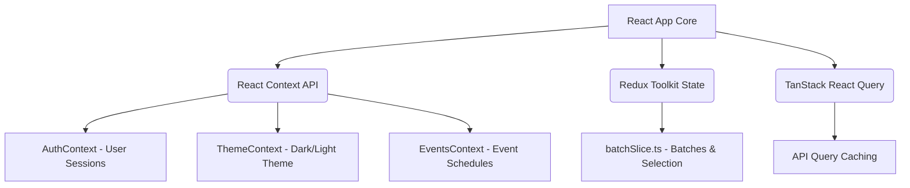
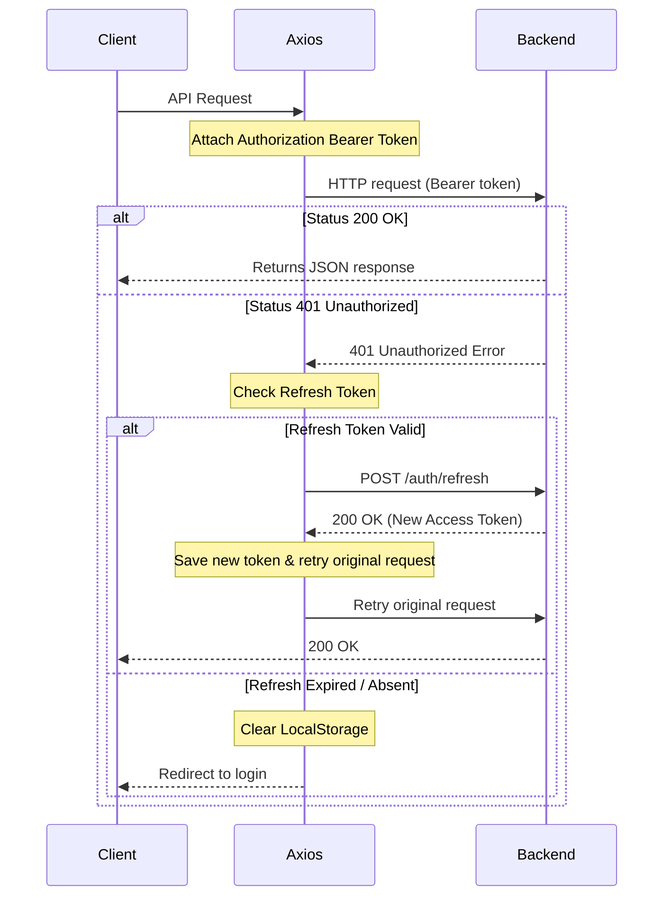
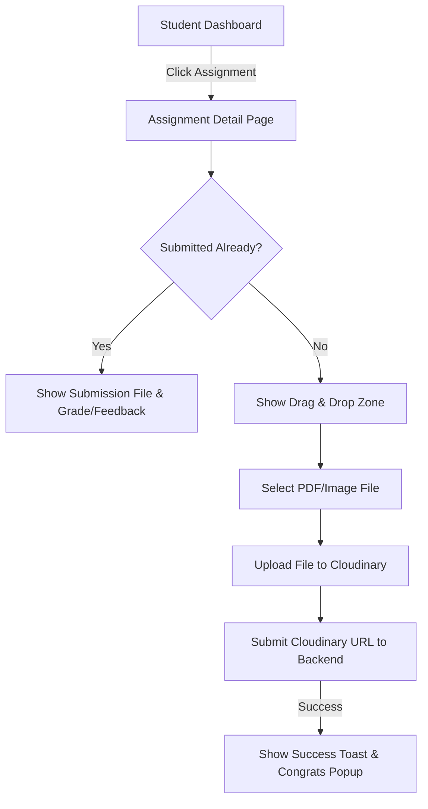
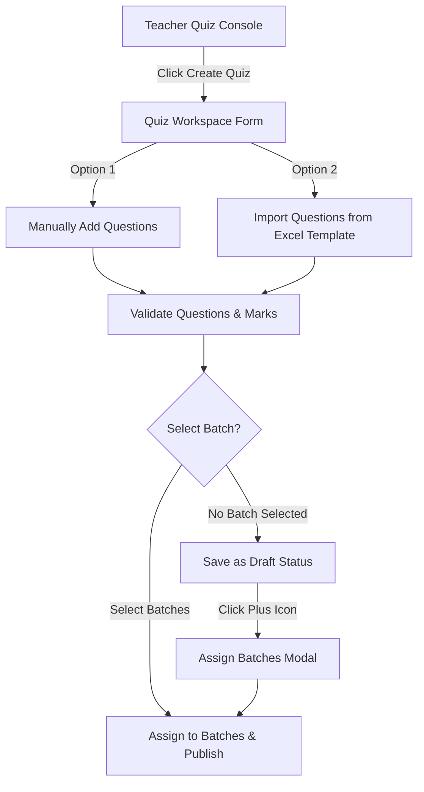
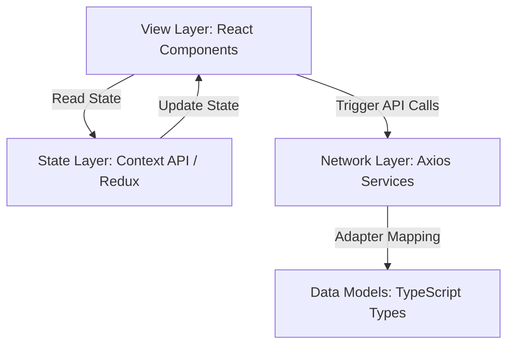

# Xebia LMS & AMS Frontend Documentation

Welcome to the official frontend technical documentation for the **Xebia Learning Management System (LMS)** & **Assignment Management System (AMS)**. This document serves as a comprehensive reference for developers, architects, and designers to understand, maintain, and extend the React application.

---

## Table of Contents
1. [Project Overview](#1-project-overview)
2. [Technology Stack](#2-technology-stack)
3. [Folder Structure](#3-folder-structure)
4. [File-by-File Documentation](#4-file-by-file-documentation)
5. [React Component Documentation](#5-react-component-documentation)
6. [Page Documentation](#6-page-documentation)
7. [UI Components](#7-ui-components)
8. [Routing](#8-routing)
9. [State Management](#9-state-management)
10. [API Integration](#10-api-integration)
11. [Authentication Flow](#11-authentication-flow)
12. [Form Handling](#12-form-handling)
13. [Styling](#13-styling)
14. [User Flow](#14-user-flow)
15. [Frontend Architecture](#15-frontend-architecture)
16. [Performance Optimization](#16-performance-optimization)
17. [Error Handling](#17-error-handling)
18. [Responsive Design](#18-responsive-design)
19. [Security](#19-security)
20. [Project Execution Flow](#20-project-execution-flow)
21. [Best Practices Used](#21-best-practices-used)
22. [Future Improvements](#22-future-improvements)
23. [Developer Guide](#23-developer-guide)
24. [Frontend README](#24-frontend-readme)

---

## 1. Project Overview

### 1.1 Introduction & Purpose
The Xebia frontend is a unified Single Page Application (SPA) merging two distinct academic modules: the **Assignment Management System (AMS)** and the **Learning Management System (LMS)**. The system is designed to digitalize academic course delivery, enable structured homework submissions, facilitate automatic and manual grading, and deliver online quizzes and certificates.

### 1.2 Features & Scope
*   **Role-Based Dashboards**: Customized landing spaces for Students, Teachers, and Admins.
*   **Interactive Course Builder**: Admin features to structure curriculum courses, modules, and lessons using drag-and-drop.
*   **Quiz Engine**: Quiz creation (Excel parsing support, saving drafts) and student quiz attempts with real-time timers and review consoles.
*   **Certificate Pipeline**: Generation, preview, Cloudinary storage, and public token-based validation of completion certificates.
*   **Event Dashboard**: Student registrations, attendance, and batch-scoped scheduling for academic events.
*   **Real-time Analytics**: Performance metrics, grade averages, and AI-driven completion progress views.

### 1.3 Folder Structure Overview
The application organizes core logic within `/frontend/src`:
```text
frontend/src/
├── assets/             # Assets (Images, logos)
├── auth-lms/           # LMS Student auth context and hooks
├── components/         # Atomic UI and Layout containers
├── constants-lms/      # Mock configurations & categories
├── context-lms/        # Secondary LMS theme hooks
├── contexts/           # Global Contexts (AMS Auth, General Theme)
├── features-lms/       # Modular features (builder, events, categories)
├── hooks-lms/          # Reusable query wrappers (useCatalog, useAuth)
├── mock-data-lms/      # Offline/Local sandbox structures
├── pages/              # Core AMS views (student/teacher dashboards)
├── pages-lms/          # Core LMS views (admin consoles)
├── store/              # Redux Toolkit slice logic
├── services/           # Axios AMS REST Clients
├── services-lms/       # Axios LMS REST Clients
├── types/              # TypeScript model type definitions
└── utils/              # Client utility converters
```

---

## 2. Technology Stack

The application stack uses the following primary libraries:

| Technology | Purpose | Implementation Details |
| :--- | :--- | :--- |
| **React 19** | Core UI Engine | Virtual DOM rendering, functional components, hooks. |
| **Vite** | Toolchain & Bundler | Hot Module Replacement (HMR) and optimized esbuild compiles. |
| **TypeScript** | Static Typing | Defines strict model constraints (`User`, `Assignment`, etc.). |
| **Redux Toolkit** | State Manager | Stores academic batch details (`batchSlice.ts`) globally. |
| **Axios** | HTTP REST Client | Maps backend endpoints; interceptors inject Bearer tokens. |
| **React Router v7** | Routing Engine | Handles client-side navigation, layouts, and route guards. |
| **Tailwind CSS** | Styling | Utility-first CSS classes for layout and dark mode control. |
| **Zod & React Hook Form** | Form Validations | Validates registration, login, and assignment inputs. |
| **dnd-kit** | Drag & Drop | Powers course curriculum tree rearrangement. |
| **html2canvas & jsPDF** | PDF Engine | Generates PDF completion certificates client-side. |
| **xlsx** | Excel Parser | Imports bulk questions from `.xlsx` tables for quiz builders. |
| **framer-motion** | Animations | Controls smooth fade-in, slide-up, and modal transitions. |

---

## 3. Folder Structure

### 3.1 Folder Rationale & Responsibilities
To accommodate modular feature scaling, the codebase separates atomic design elements, layout shells, features, and network layers:

*   **`src/components/ui/` & `src/components/ui-lms/`**: Contains stateless primitive building blocks (e.g. `Button`, `Card`, `Badge`, `Modal`). These contain no business logic and rely entirely on props.
*   **`src/components/layout/` & `src/components/layout-lms/`**: Frames the screen interface (Sidebar, header, breadcrumbs) and dynamically applies brand CSS theme tokens.
*   **`src/features-lms/`**: Independent, self-contained business logic blocks (e.g., `events/`, `category/`, `course/`). Isolates views, contexts, and mock structures specific to features.
*   **`src/contexts/`**: Shared state parameters accessed app-wide.
*   **`src/services/` & `src/services-lms/`**: Adapts raw HTTP JSON responses into typed frontend data structures using adapter functions (`mapAssignment`, `mapSubmission`).

---

## 4. File-by-File Documentation

### 4.1 Root Bootstrap Files

#### 1. [`main.tsx`](file:///c:/Rohit/Xebia%20Project/lateest%20update%2016.07.2026/frontend/src/main.tsx)
*   **Purpose**: The entry point for the React application.
*   **Responsibilities**: Retrieves the `#root` element from the DOM, initializes the React virtual DOM tree inside `StrictMode`, and injects the Redux Toolkit state wrapper.
*   **Imported Modules**: React, ReactDOM, Redux `Provider`, Redux `store`, `index.css`, `App`.

#### 2. [`App.tsx`](file:///c:/Rohit/Xebia%20Project/lateest%20update%2016.07.2026/frontend/src/App.tsx)
*   **Purpose**: Central application component.
*   **Responsibilities**: Orchestrates the client routing paths, binds context providers (Theme, Auth, LMS Providers), and injects the global toast engine (`Toaster`).
*   **Hooks Used**: `useTheme` (app theme switcher), `useAuth` (general auth validation).

#### 3. [`providers-lms.jsx`](file:///c:/Rohit/Xebia%20Project/lateest%20update%2016.07.2026/frontend/src/providers-lms.jsx)
*   **Purpose**: Consolidates LMS-specific providers.
*   **Responsibilities**: Configures the TanStack React Query client with default query stale-times (`60s`) and stacks the Theme, Toast, Auth, Student Auth, Catalog, and Events providers in a clean tree.

#### 4. [`tailwind.config.js`](file:///c:/Rohit/Xebia%20Project/lateest%20update%2016.07.2026/frontend/tailwind.config.js)
*   **Purpose**: Tailwind compiler settings.
*   **Responsibilities**: Declares custom colors for the corporate brand (Plum `#6C1D5F`, Teal `#01AC9F`), configures system fonts (Inter), and adds CSS transitions (fade-in, slide-up, shimmer).

#### 5. [`index.css`](file:///c:/Rohit/Xebia%20Project/lateest%20update%2016.07.2026/frontend/src/index.css)
*   **Purpose**: Global style script.
*   **Responsibilities**: Imports Google Fonts, loads Tailwind's directive layers, defines system-wide CSS custom properties (`:root` / `.dark`), and declares helper classes (`drop-zone`, `skeleton`, `card-hover`).

---

## 5. React Component Documentation

The codebase utilizes modular components. Key instances are documented below:

### 5.1 [`ProtectedRoute.tsx`](file:///c:/Rohit/Xebia%20Project/lateest%20update%2016.07.2026/frontend/src/components/shared/ProtectedRoute.tsx)
*   **Purpose**: Authorizes path access based on credentials and roles.
*   **Props**:
    *   `children`: `React.ReactNode` (Secure screen component).
    *   `role`: `'admin' | 'teacher' | 'student'` (Required clearance role).
*   **Hooks**: `useAuth` (retrieves `isAuthenticated` and `user`), `useLocation` (captures source navigation path).
*   **Rendering Logic**: If loading, renders a pulse loading skeleton. If unauthenticated, navigates to `/?role={role}`. If roles mismatch (e.g. Student requests `/teacher/*`), redirects the browser to the user's correct role dashboard.

### 5.2 [`Layout.tsx`](file:///c:/Rohit/Xebia%20Project/lateest%20update%2016.07.2026/frontend/src/components/layout/Layout.tsx)
*   **Purpose**: Provides standard layout framing (Sidebar + Header + Page Content) for the student and teacher consoles.
*   **Props**:
    *   `role`: `'student' | 'teacher'`.
    *   `title`: `string` (Header title).
    *   `subtitle`: `string` (Optional).
    *   `children`: `React.ReactNode`.
*   **State Variables**: `isMobileOpen` (boolean control to toggle the sidebar menu drawer on tablet/mobile screens).

### 5.3 [`CourseBuilderWorkspace.jsx`](file:///c:/Rohit/Xebia%20Project/lateest%20update%2016.07.2026/frontend/src/features-lms/course/CourseBuilderWorkspace.jsx)
*   **Purpose**: Interface for structuring course modules, curricula, and lessons.
*   **State Management**: Orchestrates section maps, drag handles, modal triggers, and form field entries.
*   **Performance Considerations**: Uses memoized selectors and handles nested structural updates locally before saving edits to prevent continuous API requests.

### 5.4 [`DataTable.jsx`](file:///c:/Rohit/Xebia%20Project/lateest%20update%2016.07.2026/frontend/src/components/ui-lms/DataTable.jsx)
*   **Purpose**: A reusable, feature-rich table grid.
*   **Features**: Dynamic search filtering, columns sorting, custom row render, action items dropdown, and pagination.
*   **Props**: `columns` (headers definition), `data` (list objects), `searchPlaceholder`, `actions` (row callbacks).

---

## 6. Page Documentation

### 6.1 Authentication

#### [`AuthPage.tsx`](file:///c:/Rohit/Xebia%20Project/lateest%20update%2016.07.2026/frontend/src/pages/auth/AuthPage.tsx)
*   **Purpose**: Unified entry page for login, portal registration, and password recovery.
*   **Layout**: Splits authentication into role-based pathways (Student, Teacher, Admin). Renders direct logins for fast demo execution.
*   **Form Schema (Zod)**:
    *   *Login*: Validates email format and password length.
    *   *Registration*: Student schema extends login and checks enrollment numbers and public batch selections.
*   **User Flow**:
    ```mermaid
    graph TD
        A[User opens website] --> B{Select Role}
        B -->|Student| C[Student Login/Register]
        B -->|Teacher| D[Teacher Login/Register]
        B -->|Admin| E[Admin Login]
        C & D & E --> F[Submit Credentials]
        F -->|Success| G[Store Access Token & Redirect]
        F -->|Failure| H[Show Toast Error Alert]
    ```

### 6.2 Student Portal

#### 1. [`StudentDashboard.tsx`](file:///c:/Rohit/Xebia%20Project/lateest%20update%2016.07.2026/frontend/src/pages/student/StudentDashboard.tsx)
*   **Purpose**: Core workspace overview.
*   **Widgets**: Circular progress bar for assignment submission ratios, due-date task listings, and recent grade summary tables.

#### 2. [`AssignmentDetail.tsx`](file:///c:/Rohit/Xebia%20Project/lateest%20update%2016.07.2026/frontend/src/pages/student/AssignmentDetail.tsx)
*   **Purpose**: Displays assignment instructions, attachment download links, and handles student uploads.
*   **UI Layout**: Left column shows rules, thresholds, and attachments; right column shows a submission drop zone with remaining deadline timers.

#### 3. [`StudentQuizzes.tsx`](file:///c:/Rohit/Xebia%20Project/lateest%20update%2016.07.2026/frontend/src/pages/student/StudentQuizzes.tsx)
*   **Purpose**: Lists active quizzes. Renders quiz attempts and links to completion certificates.

#### 4. [`QuizAttempt.tsx`](file:///c:/Rohit/Xebia%20Project/lateest%20update%2016.07.2026/frontend/src/pages/student/QuizAttempt.tsx)
*   **Purpose**: Interactive timed quiz console.
*   **Logic**: Enforces timers, tracks current index progress, and auto-submits answers on clock expiry.

#### 5. [`StudentMyCoursesPage.tsx`](file:///c:/Rohit/Xebia%20Project/lateest%20update%2016.07.2026/frontend/src/pages/student/StudentMyCoursesPage.tsx)
*   **Purpose**: Lists student-enrolled courses, categories, and tracking meters.

### 6.3 Teacher Portal

#### 1. [`TeacherDashboard.tsx`](file:///c:/Rohit/Xebia%20Project/lateest%20update%2016.07.2026/frontend/src/pages/teacher/TeacherDashboard.tsx)
*   **Purpose**: Evaluates analytics cards (Active assignments, ungraded queue count, total students).

#### 2. [`BatchManagement.tsx`](file:///c:/Rohit/Xebia%20Project/lateest%20update%2016.07.2026/frontend/src/pages/teacher/BatchManagement.tsx)
*   **Purpose**: Creates student batches and manages batch enrolments.

#### 3. [`SubmittedAssignments.tsx`](file:///c:/Rohit/Xebia%20Project/lateest%20update%2016.07.2026/frontend/src/pages/teacher/SubmittedAssignments.tsx)
*   **Purpose**: Interactive grading console. Teachers can filter by batch, inspect student file uploads, write text feedback, and score submissions.

#### 4. [`TeacherQuizzes.tsx`](file:///c:/Rohit/Xebia%20Project/lateest%20update%2016.07.2026/frontend/src/pages/teacher/TeacherQuizzes.tsx)
*   **Purpose**: Quiz creator workspace. Allows drafting, bulk importing questions from Excel tables, and assigning quizzes to multiple batches.

### 6.4 Admin Portal

#### 1. [`CategoryManagement.jsx`](file:///c:/Rohit/Xebia%20Project/lateest%20update%2016.07.2026/frontend/src/features-lms/category/CategoryManagement.jsx)
*   **Purpose**: Lists and edits LMS course folders and categories.

#### 2. [`CourseBuilderPage.jsx`](file:///c:/Rohit/Xebia%20Project/lateest%20update%2016.07.2026/frontend/src/pages-lms/CourseBuilderPage.jsx)
*   **Purpose**: Loads custom workspaces to structure lectures, lessons, and curriculums.

#### 3. [`UploadContentPage.jsx`](file:///c:/Rohit/Xebia%20Project/lateest%20update%2016.07.2026/frontend/src/pages-lms/UploadContentPage.jsx)
*   **Purpose**: Bulk uploader for images, PDFs, and video links with progress tracking.

---

## 7. UI Components

The system provides several modular components:

### 7.1 Primitive Components (`src/components/ui/` & `src/components/ui-lms/`)

#### 1. `Button`
*   **Implementation**: Extends native HTML button attributes. Configured with theme styles (`primary`, `outline`, `danger`, `ghost`, `link`) and loading indicators.
*   **Props**: `variant`, `size`, `loading` (shows spinner), `icon` (prefix icon).

#### 2. `Card`
*   **Implementation**: Generates content borders. Extends styles for hover triggers (`card-hover`).

#### 3. `Modal`
*   **Implementation**: Accessible popup layer rendering outside the primary DOM root. Employs background blurs and animations.

#### 4. `RichNotesEditor`
*   **Implementation**: Markdown text input editor with preview tabs and styling buttons.

#### 5. `ImageUploader`
*   **Implementation**: Handles Drag-and-drop actions, validates file sizes, and triggers secure media uploads.

---

## 8. Routing

The application uses **React Router DOM v7** to define paths, protect workspaces, and redirect unauthenticated sessions.

### 8.1 Routing Flow Hierarchy
```mermaid
graph TD
    Root[App Routing Entry] --> Public[Public Routes]
    Root --> Protected[Guarded Workspaces]

    Public --> Auth[/?role=student|teacher|admin]
    Public --> Verification[/verify-certificate/:token]

    Protected -->|Role: Student| StudentRoutes[/student/*]
    Protected -->|Role: Teacher| TeacherRoutes[/teacher/*]
    Protected -->|Role: Admin| AdminRoutes[/admin/*]

    StudentRoutes --> S_Dash[/dashboard]
    StudentRoutes --> S_Ass[/assignments/:id]
    StudentRoutes --> S_Quiz[/quizzes/:id/attempt]

    TeacherRoutes --> T_Dash[/dashboard]
    TeacherRoutes --> T_Batch[/batches]
    TeacherRoutes --> T_Grading[/submitted]

    AdminRoutes --> A_Dash[/dashboard]
    AdminRoutes --> A_Builder[/courses/:id/builder]
    AdminRoutes --> A_Media[/media]
```

### 8.2 Guard Configurations
*   **`ProtectedRoute`**: Evaluates active credentials. Prevents cross-role access (e.g. students accessing teacher paths) and redirects them to their respective workspace.
*   **`LmsProtectedRoute`**: Restricts the `/admin/*` path strictly to users with `admin` roles.

---

## 9. State Management

The application orchestrates state across three distinct layers:

### 9.1 State Management System



### 9.2 Global Slices (`batchSlice.ts`)
*   **Scope**: Manages the teacher's active classes.
*   **Thunks**:
    *   `getAllBatches()`: Fetches teacher batches and queries students size mapping.
    *   `createBatch()`: Submits new batch credentials.
    *   `deleteBatch()`: Deletes batch instances and updates state.
*   **State model**:
    ```typescript
    interface BatchState {
      batchList: Batch[];
      selectedBatch: Batch | null;
      loading: boolean;
      error: string | null;
    }
    ```

---

## 10. API Integration

### 10.1 Network Layer Configuration
Axios interfaces are separated into:
1.  **AMS Api Client (`/src/services/api.ts`)**: Appends auth tokens to requests and intercepts 401 errors.
2.  **LMS Api Client (`/src/services-lms/api.js`)**: Includes auto-token refreshes.

### 10.2 Request & Interceptor Flow


### 10.3 Primary Endpoint Catalog

| Endpoint Path | Method | Purpose |
| :--- | :--- | :--- |
| `/auth/login` | POST | Authenticates user roles & returns JWT tokens. |
| `/auth/register/student` | POST | Registers new student accounts. |
| `/teacher/batches` | GET/POST | Retrieves batch sizes / Creates batch profiles. |
| `/student/dashboard` | GET | Retrieves submission metrics & grades progress. |
| `/student/certificates` | GET | Fetches earned PDF credentials list. |
| `/certificates/verify/:token` | GET | Resolves certificate tokens for verification. |

---

## 11. Authentication Flow

Authentication is stateless and managed via JSON Web Tokens (JWT).

### 11.1 Key Storage Keys
*   **`xebia-student-token` / `xebia-student-refresh-token`**: Student auth tokens.
*   **`xebia-lms-token` / `xebia-lms-refresh-token`**: Admin auth tokens.
*   **`lms_user` / `xebia-student-user` / `xebia-lms-user`**: Stringified user session profiles.
*   **`lms_theme`**: Light/Dark theme user setting.

### 11.2 Logout Process
1.  Calls `/auth/logout` API to clear backend session cookies.
2.  Removes authentication keys from `localStorage`.
3.  Clears the Redux store parameters.
4.  Redirects the browser back to `/?role={role}`.

---

## 12. Form Handling

The application handles forms using **React Hook Form** for state management and **Zod** for schema validation.

### 12.1 Validation Schemas
*   **Login Form Schema (`AuthPage.tsx`)**:
    ```typescript
    const loginSchema = z.object({
      email: z.string().email('Enter a valid email'),
      password: z.string().min(6, 'Password must be at least 6 characters'),
    });
    ```
*   **Student Register Schema**: Extends `loginSchema` to validate `name` (min 2 chars), `enrollmentNumber` (min 3 chars), and `batchId` (required dropdown selection).
*   **Create Assignment Schema**: Enforces assignment title, subject selection, maximum score thresholds, and validations ensuring passing marks do not exceed total marks.

---

## 13. Styling

### 13.1 CSS Custom Variables System
Global colors and theme variables are defined in `index.css`:

```css
:root {
  --brand-primary: #4A1F4F;       /* Corporate Plum */
  --brand-primary-dark: #622865;
  --brand-secondary: #7A2676;
  --brand-success: #10B981;       /* Success Green */
  --brand-border: #E6E8F0;
  --brand-surface: #F6F7FB;      /* Light Mode background */
  --brand-background: #FFFFFF;
  --text-primary: #1F2937;
}

.dark {
  --brand-border: #334155;
  --brand-surface: #0F172A;      /* Dark Mode background */
  --brand-background: #0B0F19;
  --card-background: #1E293B;
  --text-primary: #F8FAFC;
  --text-secondary: #94A3B8;
}
```

### 13.2 Dark Mode Setup
The class-based Tailwind styling system dynamically applies `dark:` class modifiers when the `.dark` class is attached to the parent `<html>` root node by `ThemeContext.tsx`.

---

## 14. User Flow

Below is the user flow for key features:

### 14.1 Assignment Submission Workflow (Student)


### 14.2 Quiz Creation & Publishing (Teacher)


---

## 15. Frontend Architecture

The system uses a layered architecture to decouple UI components, state management, and network calls:



*   **View Layer**: Pure components in `src/components/ui` render state, features in `src/features-lms` hold logic, and layout folders provide scaffolding.
*   **State Layer**: Binds session parameters globally.
*   **Network Client Layer**: Separates AMS API interactions from LMS query builders.

---

## 16. Performance Optimization

*   **TanStack Query Caching**: Configured with a `staleTime: 60000` (60 seconds) to cache API requests, reducing redundant network requests.
*   **Client-side Certificate Caching**: Minimizes database queries by performing a bulk fetch of student certificates (`getMyCertificates()`) on dashboard mount and caching the result.
*   **Skeleton Loaders**: Custom component skeleton templates show initial visual states during loading, improving perceived performance.
*   **Asset Compression**: Images and icons use compressed SVG, WebP formats, or cloud delivery engines (Cloudinary).

---

## 17. Error Handling

*   **Axios Response Interceptors**: Automatically catch `401 Unauthorized` token failures to try refreshing the access token. If refresh tokens are expired, it clears local credentials and redirects users to the login screen.
*   **Visual Toast Alerts**: `react-hot-toast` displays non-intrusive status logs for failed requests, network timeouts, or validation alerts.
*   **Schema Error Catching**: Zod handles validation checks client-side, showing inline helper messages below fields and blocking request submissions until errors are resolved.

---

## 18. Responsive Design

The grid framework uses Tailwind CSS breakpoints to adapt to different screen sizes:

*   **Mobile Screen (`< 768px`)**: Sidebars collapse into sliding hamburger overlay layouts (`isMobileOpen`). Tables condense into structured row lists.
*   **Tablet Screen (`768px - 1024px`)**: Sidebars collapse to mini-icons. Grid structures (e.g. dashboards) adjust to double column formats.
*   **Desktop Screen (`>= 1024px`)**: Renders full expanded sidebars (`lg:pl-64`), multi-column grids, and complete data tables.

---

## 19. Security

*   **Guarded Router Consoles**: Custom router hooks prevent unauthorized directory changes and role-hopping.
*   **Sanitized Form Fields**: Form inputs are sanitized and validated using Zod schemas before being sent to backend services.
*   **Auth Token Storage**: Session validation uses access tokens, with refresh tokens stored securely in local storage.

---

## 20. Project Execution Flow

```text
[User Opens Portal]
       │
       ▼
[index.html] ─────────► Launches entry HTML document anchor
       │
       ▼
[main.tsx] ──────────► Mounts ReactDOM, Redux Provider, and StrictMode
       │
       ▼
[App.tsx] ───────────► Mounts routers, theme states, and auth context hooks
       │
       ▼
[ProtectedRoute] ────► Evaluates auth status and credentials
       │
       ▼
[Layout Wrapper] ────► Displays Header, Sidebar, and injects styling variables
       │
       ▼
[Page View] ─────────► Mounts target components (Dashboard, Assignments, etc.)
       │
       ▼
[Axios Services] ────► Fetches API data, applies adapters, and returns data
       │
       ▼
[React State Update] ◄── Updates state and triggers component re-render
```

---

## 21. Best Practices Used

*   **Type Safety**: Core models are strictly typed with TypeScript, reducing runtime errors.
*   **Decoupled Adapter Layer**: Mappers like `mapAssignment` adapt backend payloads to frontend layouts, isolating the UI from changes to backend models.
*   **DRY UI Primitives**: Atomic UI blocks (Buttons, Inputs, Badges) are centralized, ensuring consistent branding.
*   **Code Modularity**: Clear directories separate layouts, contexts, features, and network layers, making the codebase easier to maintain.

---

## 22. Future Improvements

*   **PWA Support**: Add service workers to enable offline access and caching for course materials.
*   **Web Accessibility (A11y)**: Add ARIA roles, support screen readers, and implement keyboard navigation for forms and menus.
*   **Micro-Frontend Architecture**: Decouple the LMS and AMS modules into separate apps to simplify scaling.
*   **Lottie Animations**: Replace static loading spinners with micro-animations for interactive actions like assignment uploads or quiz finishes.

---

## 23. Developer Guide

### 23.1 Installation Setup
1.  **Clone Frontend Directory**:
    ```bash
    cd frontend
    ```
2.  **Install Project Dependencies**:
    ```bash
    npm install
    ```
3.  **Configure Environment Variables**:
    Create `.env` file in the root:
    ```env
    VITE_API_URL=http://localhost:8080/api
    ```
4.  **Run Development Environment**:
    ```bash
    npm run dev
    ```

### 23.2 Creating a Page & Route
1.  Create your page component in `src/pages/` or `src/pages-lms/`.
2.  Import your new page inside `src/App.tsx`.
3.  Add the route configuration within the appropriate `<Routes>` tree, wrapping it in `ProtectedRoute` if role clearance is required:
    ```tsx
    <Route
      path="/student/new-feature"
      element={<ProtectedRoute role="student"><NewFeaturePage /></ProtectedRoute>}
    />
    ```

---

## 24. Frontend README

Refer to the primary documentation above for the developer guide. The following is a quick start guide for the frontend:

```markdown
# Xebia Academy Portal - Client App

Modular single page web app implementing the Assignment Management System (AMS) and Learning Management System (LMS).

## Setup Commands

*   `npm install` - Install dependencies
*   `npm run dev` - Start local development server (Vite)
*   `npm run build` - Compile optimized production bundle
*   `npm run lint` - Run ESLint checks (Oxlint)

## Configured Technologies

*   React 19 & TypeScript
*   Vite Toolchain
*   Tailwind CSS (utility classes)
*   Redux Toolkit & React Query
```

---

## Generating PDF Documentation
To generate a professional PDF document from this markdown file, you can use:
1.  **VS Code Markdown PDF Extension**: Open this file in VS Code, open the Command Palette (`Ctrl+Shift+P`), and run `Markdown PDF: Export (pdf)`.
2.  **Pandoc**: Run the command line compiler tool:
    ```bash
    pandoc FRONTEND_DOCUMENTATION.md -o frontend_documentation.pdf --pdf-engine=xelatex
    ```
